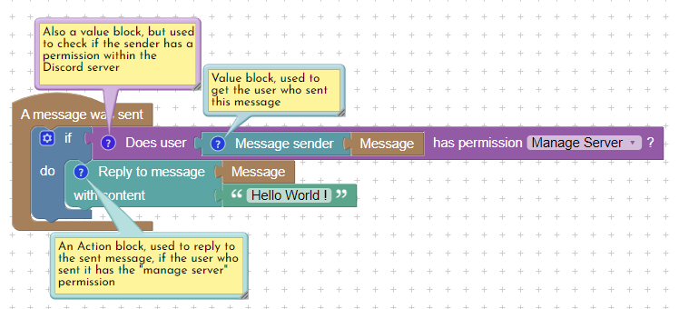

# Blocks

## How to use blocks

Blocks are used to describe what needs to be done when an event is triggered. Some can get an information, others can do something in your Discord server.

### Values blocks

These blocks are used to get an information from your Discord server, like "what's the username of this user ?" or "Does this user has this role ?". You can use the result of these blocks in others blocks.&#x20;

Here is an example :

<figure><figcaption>
A simple action flow that show how to use some value blocks.
</figcaption></figure>

When a message is sent, we check if the user has the _Manage server_ permission. The "Does user has permission" block return a **Boolean** to the "If" block. If the user has the permission, we continue, else, we can stop here since there isn't any "else" statement.

#### Values blocks types

When using values blocks with others blocks, you must be careful of the type returned by the value block, and the type needed by the used input. Some values blocks will return an User, some return a TextChannel, ...

Here is a list of available types in DIsblock :

<table><thead><tr><th>Variable type</th><th width="374">Explanations </th></tr></thead><tbody><tr><td>String</td><td>A text - Can be a word, a sentence, ...</td></tr><tr><td>Number</td><td>Also called Integer, that represent a number.</td></tr><tr><td>List</td><td>Can contain any type of elements.</td></tr><tr><td>Color</td><td>A color. </td></tr><tr><td>Boolean</td><td>Can be <strong>True</strong> or <strong>False</strong>, generally used with If/Else blocs.</td></tr><tr><td>User</td><td>Someone in your Discord server.</td></tr><tr><td>TextChannel</td><td>A text channel within your server.</td></tr><tr><td>VoiceChannel</td><td>A voice channel within your server.</td></tr><tr><td>ThreadChannel</td><td>A Thread channel within a text channel.</td></tr><tr><td>Category</td><td>A category within your server.</td></tr><tr><td>Message</td><td>A message sent by an user.</td></tr><tr><td>EmbedMessage</td><td>An embed message, to send somewhere on your server.</td></tr><tr><td>Rank</td><td>Also called Role.</td></tr><tr><td>Emoji</td><td>An emoji from Discord ( globally available ), or from your DIscord server.</td></tr></tbody></table>

### Action blocks

Action blocks are used to interact with your Discord server. These blocks must be used inside events blocks to be enabled, and are executed one by one.
