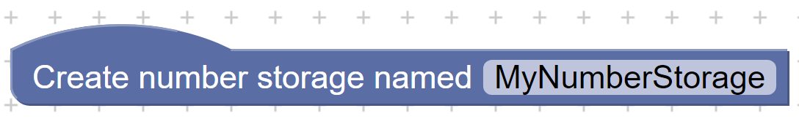
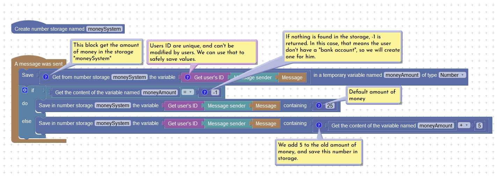
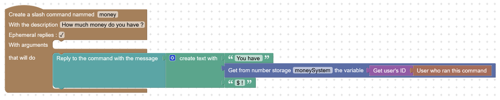
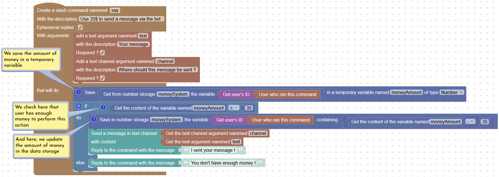
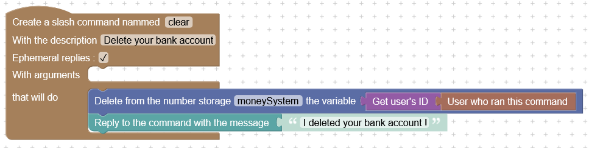

# Data storage blocks

You can now save strings and numbers in a persistent way ! This feature can be used to create XP systems, an economy, or anything you will need !


Please, keep in mind this system is currently in Alpha, and may contains some bugs or data losses. You can report any problems on the support server.


## How to manage data storage ?

### Creating a new storage

The method for creating a new storage differs slightly for string and number :



In order to save strings, you need to create a new string storage by adding this block somewhere in your workspace :

<figure><figcaption>
The "Create text storage" block
</figcaption></figure>



In order to save numbers, you need to create a new number storage by adding this block somewhere in your workspace :

<figure><figcaption>
The "Create number storage" block
</figcaption></figure>



Keep in mind that storage names **must not contain special characters** and be **between 3 and 28 characters** long.

### Deleting a storage

You can easily delete a storage by removing from the workspace the _create storage_ block associated with the storage you want to erase.


Deleting a storage will delete everything stored in this storage. This operation can't be  cancelled, even with a rollback !


## Save, read, or delete a value in a storage

### Keys and values

In order to manage values in storage, we need to find these values. We can do it with a _Key (_ variable name ).\
If it helps, we can see it as a wall of drawers. The **storage name** helps to identify the wall of drawers, the **Key** ( or variable name ) is what is written on the drawer, and the **value** is what is inside the drawer.

You should always choose appropriate names for stored values. For example, if you want to store something about an user ( XP, amount of money... ), you should use the Discord ID of this user, since it will never change.


Each storage can contains up to 10.000 values. This limit may be raised later.\
Keys should not excess a length of 32 characters, and values can't excess a length of 1024 characters.


### Example : Money system

We will create a little money system in order to discover the basics about data storage. Users will have a default amount of money. Money can be obtained by sending a message, and used to send a message via the bot. Also, users can delete their bank account. We will use a number storage, but string storage can be used the same way.

#### Giving money when a message is sent

The first step is to give money to users. Each time a message is sent, we add 5$, or give 25$ as default value for users who don't have a "bank account".

<figure><figcaption>
How to give money to users when a message is sent
</figcaption></figure>

Firstly, we get user's money in the storage. This value is saved in a temporary variable, so we can access it easily. If the value is -1, it wasn't found ( user never sent a message ), so we will give him a default amount of money. In others cases, we just add some money.


If the value isn't found, you will get **-1** in case of number storage, or "**undefined**" for string storage.


#### Viewing amount of money

Users will need to check how much money they have. We can do this easily with a simple command :

<figure><figcaption>
This command allows users to check how much money they have
</figcaption></figure>

#### Buying something

Money must also be used for something. You could create a lot of things with Disblock, but to keep things simple, we will just create a `/say` command to send a message via the bot.

<figure><figcaption>
A command that will send a message via the bot by paying some money.
</figcaption></figure>

Here, we created a slash command, with some arguments. We get the amount of money, that is stored in a temporary variable, then we check that user has enough money. If yes, we send the message, and remove 35 from the money in storage.

#### Deleting a bank account

In some cases, users may want to delete their data. We can create a command to do this easily :&#x20;

<figure><figcaption>
A command that delete a value in a storage.
</figcaption></figure>

#### Final result

<figure><figcaption>
Some tests to confirm that everything is working
</figcaption></figure>

You can see the final result on the screenshot, everything is working as expected. First, we can see -1$, which is because no messages were sent before. After the first message, the bank account was created, with 25$ on it. The second message was paid 5$. At this point, we have 30$, which wasn't enough to use `/say`. After a third message, we have 35$, enough for `/say`. After this command, there is 0$ left.
