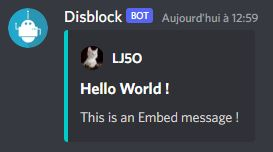

# Embeds blocks

Sometimes, you way want something better than simple text messages, and to replace them, you can use some Embed Messages. Let's see how to use them !

Here is the minimal action flow to create and send an Embed message :

<figure><figcaption>
The minimal Action flow to send an Embed message
</figcaption></figure>

<figure><figcaption>
The result of the created embed
</figcaption></figure>


When creating an Embed Message, you will probably want to send it. That can be done with the _Send embed message_ Block.


For now, that's only a very simple Embed message, but by adding few options to our _Create an embed message_ block, we can create way more complexes messages, like this one :&#x20;

<figure><figcaption>
An embed message, using all the possibles options.
</figcaption></figure>

## Embed messages options

Let's see what are the available options :

### Define Embed Image

Probably one of the most used, this option will add an image to your Embed :

<figure><figcaption>
The block <em>Define Embed Image</em> was added in the customization input of the <em>Create embed</em> block
</figcaption></figure>

<figure><figcaption>
An image was added to the embed. ( <a href="https://pixabay.com/fr/photos/cat-jeune-animal-chaton-chat-gris-2083492/">Source</a> )
</figcaption></figure>

### Define Embed Thumbnail

This option will add a thumbnail to your embed, always at the right top of the message :

<figure><figcaption>
This time, the <em>Define Embed Thumbnail</em> block is used in the customization input
</figcaption></figure>

<figure><figcaption>
The thumbnail was added to the Embed message ( <a href="https://pixabay.com/fr/photos/cat-animal-de-compagnie-animal-300572/">Source </a>)
</figcaption></figure>

### Add a field

Fields can be used to add more informations or details to the message. Each field have a maximum length of 512 characters.

<figure><figcaption>
Three fields are added in the customization input
</figcaption></figure>

<figure><figcaption>
The embed created by the above action flow
</figcaption></figure>

<figure><figcaption>
The same embed, but if the <em>inline</em> option isn't checked
</figcaption></figure>

### Set Embed's author

You can show who created this embed, and even add a link to a website and a picture :

<figure><figcaption>
The <em>set author</em> block was added. You must specify the author's name, but you don't need to give an URL or an image.
</figcaption></figure>

<figure><figcaption>
The created embed, "LJ5O" is a link to https://disblock.xyz ( <a href="https://pixabay.com/fr/photos/cat-chaton-animal-de-compagnie-551554/">Source </a>)
</figcaption></figure>

### Add a footer

It is possible to add a small text and a picture at the end of your embed, with the _Add Footer_ block :

<figure><figcaption>
This time, we added the <em>add footer</em> block. You don't need to specify an image for it to work.
</figcaption></figure>

<figure><figcaption>
The created embed, with the footer. ( <a href="https://pixabay.com/fr/photos/cat-chaton-animal-de-compagnie-551554/">Source </a>)
</figcaption></figure>

### Add timestamp

If you need to show when the embed was sent, you can use the _Add Timestamp_ block :

<figure><figcaption>
The <em>Add Timestamp</em> block was added in the customization input
</figcaption></figure>

<figure><figcaption>
The timestamp is visible at the end of the embed message.
</figcaption></figure>
