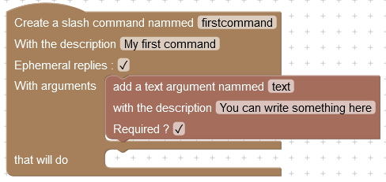
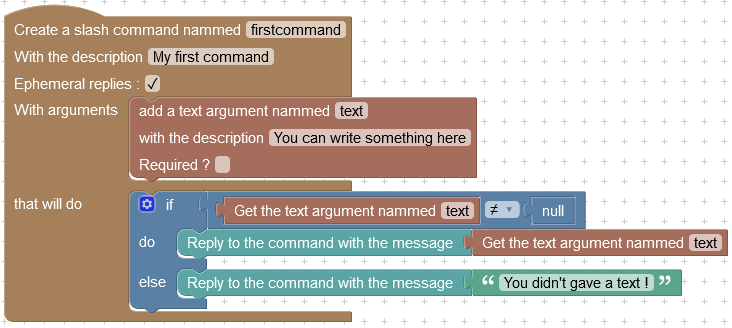

# Slash commands

Disblock also support Discord's slash commands ! You will learn everything about these on this page

## Global commands

These commands are available on every servers where Disblock is working. Here are available global commands :&#x20;

| Command name      | Required permission | Purpose                                   |
| ----------------- | ------------------- | ----------------------------------------- |
| `/help`           | @everyone           | Show how to get started with Disblock     |
| `/reloadcommands` | Administrator       | Reload the slash commands for your server |

You can manage these commands in your server's integrations settings.

## Creating custom slash commands

In addition to the global commands, you can create slash commands on your server ! You can give them a name, a description, some arguments, and action blocks to execute when this command is used.

### How to use the command creator block

Every custom slash commands will have to be defined, with this block :

<figure><figcaption>
The command creator block
</figcaption></figure>

Here are the parameters that this block need :&#x20;

* **Name** : At least 3 characters, must be lower case and alphanumeric. This is the command name, which will be used to execute this command.
* **Description** : Not required, must be alphanumeric. It will be displayed when someone will write the command name.
* **Ephemeral replies** : If you want the replies to be only visible by the user who called the command, enable this.
* **Arguments** : Arguments that users will need to provide when using your command.
* **To do** : The blocks that will describe what the bot need to do when this command is used.


Keep in mind that you need to use at least one reply block when executing your command


### Command arguments

If you need the user to specify a channel, an user, a role, or to give a number or a text, you can add an argument to your command ! Arguments can be required or optional, but **you must define required ones first**. Names and descriptions follow the same requirements as for commands.

You can add an argument by dragging a block in the arguments input of the command creator block. Here is an example :&#x20;

<figure><figcaption>
A required text argument was added to the command.
</figcaption></figure>

#### Working with arguments



Required arguments are guaranteed to contain a value, since Discord doesn't allow users to send a command if an optional argument isn't valid. You can directly get the value of this argument :&#x20;

<figure><figcaption>
We directly get the value of the text argument.
</figcaption></figure>



Optional arguments may contain a value, but could also be undefined if the user didn't gave a value. Before using these arguments, you should check that they was defined by the user :&#x20;

<figure><figcaption>
We check that the text argument was defined before using it. If the user didn't gave a value for this argument, it will contain <code>null</code>.
</figcaption></figure>


If you use optional arguments, you must ensure that you're using a defined argument. If you want to work on an user, a role, or anything else with an undefined argument, you will get an error, and the bot won't work.




## Registering new commands on your server

The last step to make your commands usable on your server ! Once you successfully saved your work on the panel, you can run the command `/reloadcommands` on your discord server. The bot will show you how many commands were loaded, and you're done !


If the bot didn't loaded as many commands as you expected, there may be a problem with your command in the editor. Maybe you didn't give action blocks, or something else was invalid.


### Managing your commands

You can also define permissions for your commands, so that only authorized users can use them ! Go in your server's integrations settings, then select Disblock, and you will see a list of all commands enabled on your server :&#x20;

<figure><figcaption>
The command list on Discord. You can see and manage every commands enabled on your server here.
</figcaption></figure>

By clicking on a command, you will open the permissions editor for this command :&#x20;

<figure><figcaption>
You can manage a specific command permissions here.
</figcaption></figure>

This editor allow you to restrict who can use this command, and where.
