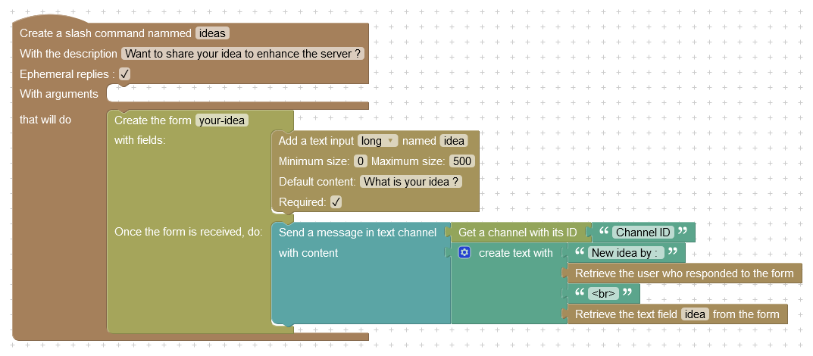
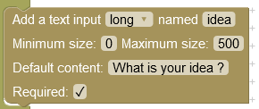
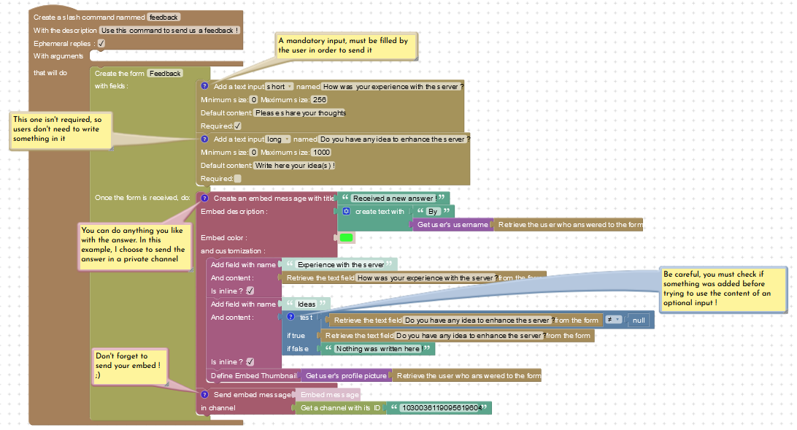
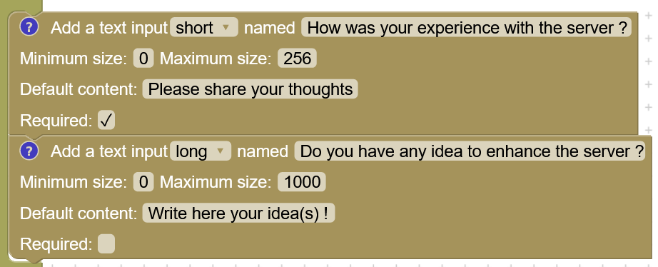
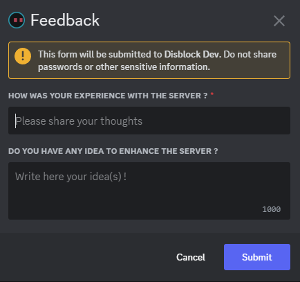
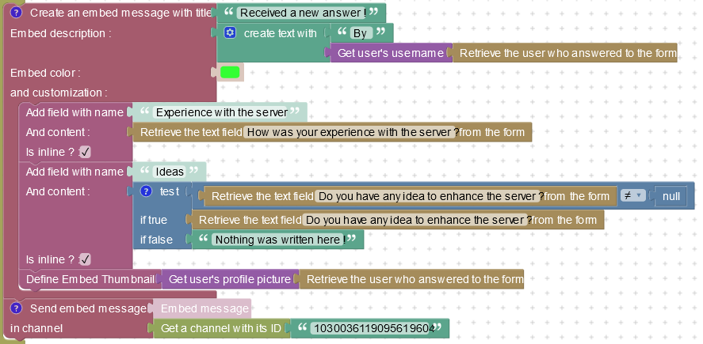
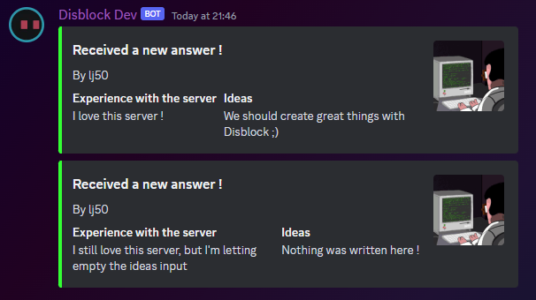
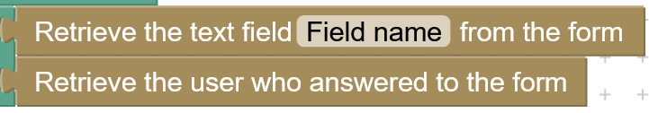
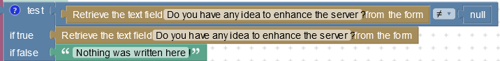

# Forms

Ever wanted to have the possibility to create a nice form to ask people about their feedback ? Well, that's now possible with Disblock !


This feature is currently in alpha, if you come across a bug, please, report it on the Discord support server, or GitHub. This feature may be modified anytime.



Before reading this, you should learn how to use the [.](./ "mention")


## How to create a form

Forms are defined like a slash command, but instead of adding statements to execute, you just add a form creator block :&#x20;

<figure><figcaption>
A form defined within a slash command
</figcaption></figure>

Within this example, you can see that we defined a form, entitled _`your-idea`_, with a text input named _`idea`_. When we receive an answer to this form, we will send a message in a specific text channel, that will show us the user who answered, and the content of the _`idea`_ input.

### Fields


You can have up to 5 fields per form.


#### Text input

The text input is a basic input block, that can be used for anything. Here are some settings available on it :&#x20;

<figure><figcaption>
A text input block, can only be used within a form block
</figcaption></figure>

* **Type** : Can be **short** or **long**, it represent the rendered size of this input in the popup displayed to the user.
  * Use short for simple sentences, or something that will be.. short. Use long if the user may need to write something bigger, like a paragraph or a detailed answer.
* **Name** : The name of this input. It works the same way as the slash commands arguments.
* **Minimum size** & **Maximum size** : two numbers that represent the min and max size of the content in this input. Users can't send their answer if this requirement is not satisfied.
* **Default content** : A placeholder that is displayed when nothing was written by the user yet.
  * Use this to give some details or indications to the user who is filling your form.
* **Required** : A checkbox that is used to indicate if an input must be filled or can be let empty. Users can't send their answer if this requirement is not satisfied.

### Handling an answer

Once someone filled your form, you will want a way to get the content of the inputs : that's exactly what we will do in the last part of this block ! You can either send a message/embed in a private channel with everything you need, or save that in a [data-storage-blocks.md](../data-storage-blocks.md "mention").


You probably saw that no _reply to command block_ were used in the previous example : this block is useless when working with forms as it can only reply to slash commands. When handling forms, we will prefer to use a _send message in channel_ block or to create an embed to save answers.


## Example : the feedback form&#x20;

Here is the simple form that we will create. Don't be afraid, I'm going to explain everything about it :&#x20;

<figure><figcaption>
The complete example to create a form
</figcaption></figure>

### Defining the fields in a form

<figure><figcaption>
The fields of the form.
</figcaption></figure>

Here is how these inputs are rendered on Discord :&#x20;

<figure><figcaption>
How the form will be displayed to users.
</figcaption></figure>

As expected, the _short_ input is rendered as a single line of text, while the _long_ input is larger and can handle multiple lines. You can also see the red \* at the first input, which mean that this question requires an answer. An input without this can be sent empty.

### Handling answers

So, we can now display the form to users using our form command. Next, we should talk about handling answers and reading them !

<figure><figcaption>
The last part of the form, the action blocks defining what we should do when a form is submitted.
</figcaption></figure>

You can do everything you want there, but in this example, we can see that [embeds-blocks.md](../embeds-blocks.md "mention") are used, displaying properly the received answer. Once created, this embed is sent to a private channel, where staff members can take care of it.

<figure><figcaption>
The embed defined in the previous screenshot.
</figcaption></figure>

There are also two new blocks related to forms, that you can use while processing answers :

<figure><figcaption>
These blocs can only be used within a form creator block.
</figcaption></figure>

The first block is used to get the content of a field/input within your form, the same way you can get the value of a command argument. The second block is referring to the user who submitted the form.


Like arguments in [.](./ "mention"), you should always check that not required inputs are defined before using them to avoid unexpected errors ! If you're trying to get the value of an empty input, you will just get `null`


<figure><figcaption>
Checking if the optional input was filled. If it was left empty, a default value is used.
</figcaption></figure>

And, that's it ! Don't forget to execute `/reloadcommands` and you should be able to use your form ! If you have any question or need help about this feature, feel free to join the Discord server !
