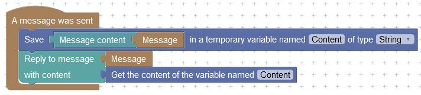

# Temporary variables blocks

Instead of calling every time the same blocks to get a value in an event, you can get it one time, and save it temporarily with the temporary variables blocks. Here is the example :

<figure><figcaption>
The message's content is saved in a temporary variable, and the content is got later to reply to the message.
</figcaption></figure>

These variables can't be shared between events, and are deleted after the execution.
