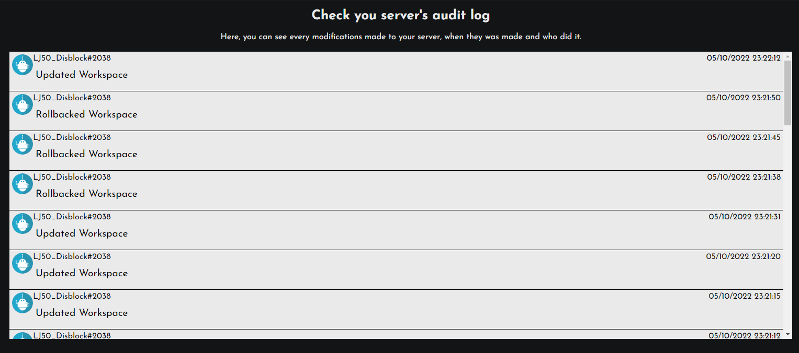

# Logs

When multiples server administrators use the dashboard to configure Disblock, you will probably want to know who worked on it, and when. That's why there is the Audit logs !

### How to view the logs ?

Just click on "Modifications logs", above the editor !\
You will see this page :&#x20;

<figure><figcaption>
The audit logs.
</figcaption></figure>

You can find here the lasts things that happened to your server !
