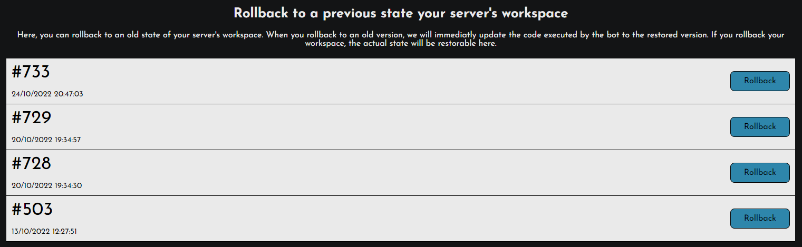

# Rollbacks

Sometimes, you may need to go back to a previous version of your work. Especially when you just messed up the entire workspace and sent it. In this case, you can use the rollback system !

### How to rollback my workspace ?

You can access the rollbacks page by clicking on "Rollback workspace" above the editor.\
You will see this page :

<figure><figcaption>
The rollbacks available for the server
</figcaption></figure>

You can click on the blue "Rollback" button to restore the old state of your work. If you decide to go back, and retrieve your newest changes, you can get them the same way by rollbacking the latest saved workspace.
