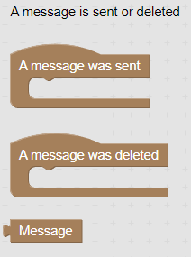
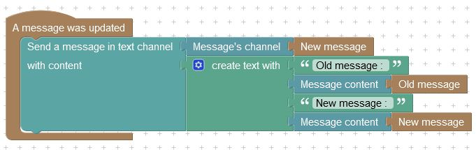

# Events

## How to use events&#x20;

With Disblock, every action flow start by an event. We wait that something happens first, then we can run our action flow.

You can see that events may have some related variables blocks. Here is an example :

<figure><figcaption>
You can see that these events have a "message" variable block related.
</figcaption></figure>

When using these events, you can use the variable block to get the sent/deleted message, and use   it in your action flow. This way, you can get informations from the message that triggered the event.

#### Events with "Old/New" variables blocks

Some events may have two variables blocks of the same type. In this case, they will represent the old and new states of something. Here is an example :

<figure><figcaption>
How to use an event with "old/new" variables blocks.
</figcaption></figure>

In this example, the event is triggered when a message is updated. We can obtain the old and new states of the message, and get the content of the message before and after the edit.


This event work only with recently sent messages, we can't get the old state of a message if it was sent too long ago.

