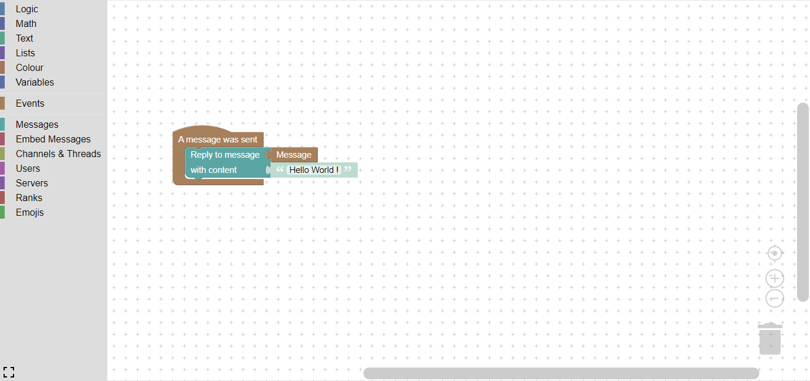

# First steps

You just added Disblock to your server and was wondering how to get started ? You came to the right place !

## What's Disblock ?

That's an entirely customizable Discord bot. With a block-based editor, you can define your own actions flows, executed when an event get triggered in your Discord server.

## The Workspace

That's here that you will create your action flows ! You can access it on the [dashboard](https://disblock.xyz/panel), after logging in and selecting a server to edit.&#x20;

<figure><figcaption>
The Workspace, or the editor.
</figcaption></figure>

### What's on it ?

At the left side, you can see the categories of blocks. You can click theses to see or use the associated blocks.

<figure><figcaption>
The blocks in Events category. You can drag and drop the blocks to use them.
</figcaption></figure>

At the bottom left corner, there is the full-screen mode, and at the bottom right corner, the zoom options and the trashcan. If you removed blocks from your workspace, you can get them back by clicking on the trashcan.

If you need more explanations about a block, you can hover it with your mouse to see some informations.

## Creating your first action flow

For your first action flow, we will create an "Hello World". The first step is to get an event block. This type of block is always the first block of an action flow. When the event is triggered, the action flow is executed.

We will use the "A message was sent" event to start. You can get it by clicking on "Events" category on the left, and by dragging the block in the editor. We will also get the Event variable block "Message", that will allow us to get the sent message ( The message that triggered this event ).

If you need help with the events blocks, you can read this :


[events.md](events/events.md)


The workspace should looks like this at this point :&#x20;

<figure><figcaption>
The event block "A message was sent" and his variable "Message"
</figcaption></figure>

We will reply `Hello World !` to this message. Since we will perform an action on this message, we can open the "Messages" category, and get the "Reply to message" block. Place it in the event, and the block should now be activated.

You can now attach the "Message" block to the message input, and type `Hello World !` in the text input ( or attach another String block ).

The workspace should now looks like this :&#x20;

<figure><figcaption>
The <code>Hello World !</code> , ready to be used. We added the action block "reply to message", and gave to this block the sent message and the content of the reply.
</figcaption></figure>

Now, this example is complete ! You can save it with the button under the editor, and send a message somewhere in your Discord server to see the result !


If that don't seems to work, check the permissions that you gave to the bot. You can also read the Troubleshooting page.


If you want, you can try Disblock by modifying this action flow ! Here is a small example :&#x20;

<figure><figcaption>
Here, we get the user who sent the message, and check if he has an Administrator permission. If yes, we reply with his nickname + "is an administrator". If the user isn't an admin, we just react with ❌.
</figcaption></figure>

Of course, there's a lot more you can do with Disblock, so don't hesitate to check the available blocks in the categories !\
That's all for this quick introduction to Disblock, but if you want to learn more, you can read the docs, or discover by yourself.\
If you're feeling stuck, feel free to join the support server !
