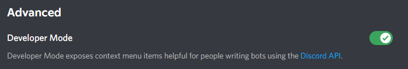
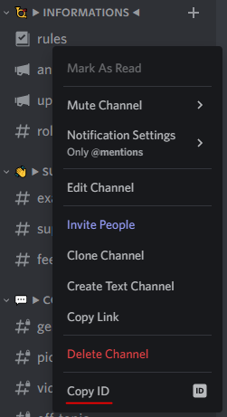

# How to get the Discord ID of something

When using Disblock, you may need to get something with an ID. It can be an user, a channel, a role, or anything else; the way to get this ID is generally the same :

### Enabling Developer mode

Firstly, you will need to enable the developer mode. Go in the settings of your account, then in `Advanced` and enable the `Developer Mode`.

<figure><figcaption>
The Developer Mode, enabled. You can disable it the same way you enabled it.
</figcaption></figure>

### Getting the ID

Now that the Developer mode is enabled, you can right-click on something, and the option `Copy ID` should have appeared. You can now select this to have the ID of this element in your clipboard, ready to paste in the editor !

<figure><figcaption>
You can now see the Copy ID option in the right-click menu.
</figcaption></figure>
